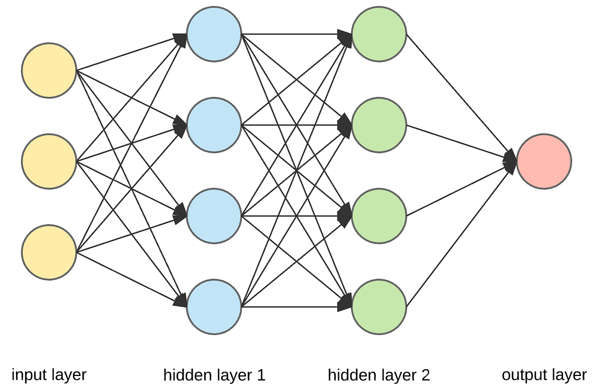

</br>

---


---


</br>


</br>

# Design of CMOS based Artificial Neural Network (ANN)

This repository presents the design of a CMOS based ANN using skywater 130nm PDK


# Table of Contents 

 * [Introduction](#Introduction)
 * [Block-Diagram](#Block-Diagram)
 * [Specifications](#Specifications)
 * [Open Source Tools Used](#Open-Source-Tools-Used)
 * [Clone This Repository](#Clone-This-Repository)
 * [Simulation Tools](#Simulation-Tools)
   * [Tools And PDK Used For Design and Simulations](#Tools-And-PDK-Used-For-Design-and-Simulations)
     * [Installation Of Tools And PDK](#Installation-of-Tools-and-PDK)
 * [Schematics And Simulations](#schematics-and-simulations)
   * [Gilbert Cell Multiplier](#Gilbert-Cell-Multiplier)
      * [Schematics](#Schematics)
      * [Simulations](#Simulations)
   * [Sigmoid Neural Activation Function](#Sigmoid-Neural-Activation-Function)
      * [Schematics](#Schematics)
      * [Simulations](#Simulations)
   * [Simple ANN Network](#Simple-ANN-Network)
      * [Schematics](#Schematics)
      * [Simulations](#Simulations)
   * [CMOS ANN Implementation](#CMOS-ANN-Implementation)
      * [Schematics](#Schematics)
      * [Simulations](#Simulations)
 * [Executing The Simulations](#Executing-the-simulations)
 * [Observations](#Observations)
 * [Future Work](#Future-work)
 * [Author](#Author)
 * [Acknowledgements](#Acknowledgements)

# Introduction 

An Artificial Neural Network (ANN) is a computational model inspired by the structure and functions of biological neural networks in the human brain. It consists of layers of interconnected nodes, called neurons, which process information through a system of weighted connections. Each neuron receives inputs, processes them through activation functions, and transmits outputs to other neurons in subsequent layers. This layered structure enables ANNs to learn complex patterns and relationships in data, making them powerful for tasks such as classification, regression, and even decision-making.

ANNs are a foundational element in machine learning and artificial intelligence, with applications in image and speech recognition, natural language processing, medical diagnostics, financial predictions, and many more fields. The training process for ANNs involves adjusting weights using algorithms like backpropagation, enabling them to improve performance on specific tasks by minimizing prediction errors. As they learn from data, ANNs can approximate complex functions and make predictions on unseen data, making them one of the most versatile tools in modern AI.

<h3 align="center">A Simple Neuron Architecture</h3>
<p align="center">
  
</p>

<h3 align="center">ANN Model</h3>
<p align="center">
  
</p>

<h3 align="center">ANN Model</h3>
<p align="center">
  
</p>


Designing a CMOS-based Artificial Neural Network (ANN) involves leveraging analog circuitry for efficient and low-power computation, which is particularly suited for edge computing applications and systems with strict energy constraints. In this approach, the Gilbert cell multiplier and a CMOS circuit implementation of the sigmoid activation function are key components.

  ##    Gilbert Cell Multiplier for Weight Multiplication
The Gilbert cell is a well-known analog circuit structure used for multiplication, traditionally applied in frequency modulation and demodulation.
For ANN design, each neuron connection (synapse) requires a multiplier to scale the input by a corresponding weight. The Gilbert cell provides a compact and efficient method for this multiplication in the analog domain.
The basic configuration of a Gilbert cell uses a differential pair with cross-coupled transistors that produce an output current proportional to the product of the input signals. By using CMOS transistors in this structure, it can be made compatible with standard CMOS fabrication processes.
This analog multiplication enables the neuron to process signals with minimal power and high speed compared to digital multipliers, which can be a bottleneck in traditional ANN implementations.

  ##    Sigmoid Activation Function in CMOS

  <h3 align="center">Sigmoid - Neural Activation function</h3>
<p align="center">
  
</p>


The sigmoid function, commonly used as an activation function in neural networks, introduces non-linearity, allowing the network to approximate complex functions and make decisions beyond simple linear separations.
Implementing a sigmoid function in CMOS can be challenging due to its exponential nature. However, various CMOS circuit designs approximate the sigmoid curve effectively.
One approach is to design a circuit that exploits the inherent characteristics of MOS transistors in weak or moderate inversion to approximate the exponential function. By setting up the transistors in specific configurations, it is possible to create an analog sigmoid-like response.
For instance, a differential amplifier with MOSFETs biased appropriately can produce an output that resembles the sigmoid function’s shape, providing the necessary non-linearity for the ANN.


# Block-Diagram

The block diagram of the proposed CMOS ANN can be found below: </br>


<p align="center">

</p> 

*[Back To Top](#Table-of-Contents)* ⤴️ 

</br>

# Specifications

| Parameter                   | Symbol | Min Value | Typical Value | Max Value | Unit |
|:---------------------------:|:------:|:---------:|:-------------:|:---------:|:----:|
| Technology                  | -      | -         | 180           | -         | nm   |
| Supply Voltage              | VDD    | -         | 900           |           | mV   |
| Supply Voltage              | VSS    | -         | -900          |           | mV   |
| Operating Temperature Range | T      | -40       | +27           | +85       | °C   |
| Input   Voltage             | Vin    | -1        | 100m          | 1         | V    |
| Input   Voltage             | Vout   | -1        | -             | 1         | V    |


 
</br>

*[Back To Top](#Table-of-Contents)* ⤴️ 

</br>
 
# Open Source Tools Used

 🔶 eSim
 
   * eSim (previously known as Oscad / FreeEDA) is a free/libre and open source EDA tool for circuit design, simulation, analysis and PCB design. It is an integrated tool built    using free/libre and open source software such as KiCad, Ngspice and GHDL. eSim is released under GPL.It can serve as an alternative to commercially available/licensed software tools like OrCAD, Xpedition and HSPICE.

        🔗 https://esim.fossee.in/home
 
 🔶 Ngspice
 
   * Ngspice is a mixed-level/mixed-signal electronic circuit simulator.
   * Ngspice is based on three open-source free-software packages: 
      * Spice3f5
      * Xspice
      * Cider1b1
   
      🔗 http://ngspice.sourceforge.net/
     
        
 🔶 Sky130 PDK
 
   * The SKY130 is a mature 180nm-130nm hybrid technology originally developed internally by Cypress Semiconductor before being spun out into SkyWater Technology and made accessible to general industry. SkyWater and Google’s collaboration is now making this technology accessible to everyone.
   * The SKY130 Process Node is an extremely flexible offering, including many normally optional features as standard (features like the local interconnect, SONOS functionality, MiM capacitors, and more). This provides the designer with a wide range of flexibility in design choices.
   
     🔗 https://github.com/google/skywater-pdk

</br>

*[Back To Top](#Table-of-Contents)* ⤴️ 

</br>

# Clone This Repository 

  * Clone this repository using git clone command 
 
 ```
 $ git clone https://github.com/Nalinkumar2002/cmos_ann.git
```

</br>

*[Back To Top](#Table-of-Contents)* ⤴️ 

</br>

# Simulation Tools

## Tools And PDK Used For Design and Simulations
  * eSim
  * Ngspice
  * Skywater130 PDK
  
### Installation Of Tools And PDK

📥 eSim:
 
  * Install the eSim tool using this website given below. Latest eSim version comes with Skywater130 PDK by default. 
  
     🔗 https://esim.fossee.in/downloads
   
  *  You can also refer to the eSim Spoken Tutorial.
  
     🔗 https://spoken-tutorial.org/tutorial-search/?search_foss=eSim
     
📥 Ngspice :
 
  * Install Ngspice using this website given below.

    🔗 http://ngspice.sourceforge.net/download.html
   
📥 Sky130 PDK :  
 
   * Use git clone method  
   
    $ git clone https://foss-eda-tools.googlesource.com/skywater-pdk/libs/sky130_fd_pr
   
 > Place `sky130_fd_pr` folder in current working directory to avoid errors during simulations.
 

# Schematics And Simulations 

## Gilbert Cell Multiplier

### Schematics 

It is designed and made as subcircuit to use it as a symbol.

<p align="center">

</p>

### Simulations

After creating the schematics, spice netlist was extracted with the help of esim and the necessary model files of `sky130 models`  transistors were included in the netlist and transient analysis was performed.


💠 Input signal 100mv Vpp and frequency of 5kHz and 50kHz are given.

<p align="center">

</p>


💠 Output of Gilbert cell multiplier - multiplied signal of 2 input signals

<p align="center">

</p>

</br>

*[Back To Top](#Table-of-Contents)* ⤴️ 

</br>

## Sigmoid Neural Activation Function

### Schematics 

It is designed and made as subcircuit to use it as a symbol.

<p align="center">

</p>

### Simulations

After creating the schematics, spice netlist was extracted with the help of esim and the necessary model files of `sky130 models`  transistors were included in the netlist and transient analysis was performed.


💠 Output of NAF - DC sweep is done from -1V to 1V

<p align="center">

</p>

</br>

*[Back To Top](#Table-of-Contents)* ⤴️ 

</br>

## Simple ANN Network

### Schematics 

<p align="center">

</p>

### Simulations

💠 Input signal 100mv Vpp and frequency of 5kHz and 50kHz are given & 150mv Vpp and frequency of 3kHz and 30kHz are given.

<p align="center">

</p>


<p align="center">

</p>

💠 Multiplied signal outputs

<p align="center">

</p>


<p align="center">

</p>


💠 Simple ANN Output

<p align="center">

</p>

</br>

*[Back To Top](#Table-of-Contents)* ⤴️ 

</br>

## CMOS ANN Implementation

### Schematics 

<p align="center">

</p>

### Simulations

💠 Input signal with different frequency and voltages are given.

<p align="center">

</p>


💠 CMOS ANN Output

<p align="center">

</p>


 </br>

*[Back To Top](#Table-of-Contents)* ⤴️ 

</br>

# Executing The Simulations
 
  * Run the `neuron.cir.out` file in ngspice to perform simulations
  * 
  * Please check `spice_lib` folder is in current directory. It consists of skywater 130nm MOSFET models `sky130_fd_pr__nfet_01v8__tt` & `sky130_fd_pr__nfet_01v8__tt`.

 ### In `Ngspice` give the following command
 
 ``` 
 neuron.cir.out
 ```


 > Note: To run simple neuron, naf, gilbert multiplier, run `neuron1.cir.out` , `snaf.out` and `sgil.out`


# Observations

 🏷️   The work demonstrates the VLSI implementation of artificial neural networks in CMOS technology node
 
 🏷️   Analog components such as gilbert multipliers, adders and differential amplifiers are employed to realize the biological neural network.
 
 🏷️   The response of the proposed CMOS neuron is approximately equivalent to that of the real neuron.
 
 </br>

*[Back To Top](#Table-of-Contents)* ⤴️ 

</br>
 
# Future Work 
  
  🏁  Further improvements and modifications in this work can lead to the development of generic technology which results in the bidirectional communication between the living neurons and the micro-electronic neurons
 
 # Author
 
  🖊️ Nalinkumar S , B.E (Electronics and Communication Engineering), Madras Institute of Technology, Anna University, Tamil Nadu 
 
 
 # Acknowledgements

 📖 Kunal Ghosh, Co-Founder of VLSI System Design (VSD) Corp. Pvt. Ltd.


